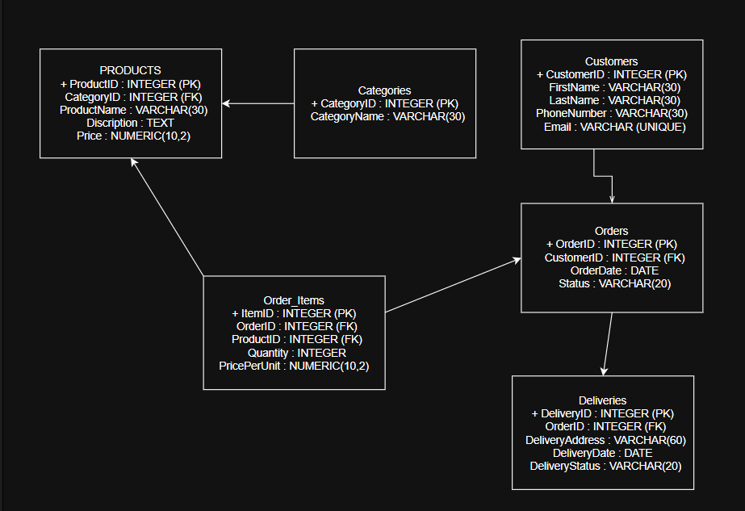

# Отчёт по домашнему заданию

## Part 1: Выбор Сценария
Для данной работы выбран сценарий: Онлайн-магазин электроники. Эта система будет управлять товарами, их категориями, покупателями, заказами, составом заказов и доставкой.

## Part 2: Проектирование Базы Данных и Документация

### Идентификация Сущностей и Атрибутов
- Products (Товары) – хранит информацию о товарах
- Categories (Категории) – хранит категории товаров
- Customers (Покупатели) – хранит информацию о покупателях
- Orders (Заказы) – хранит информацию о заказах
- Order_Items (Состав заказа) — связующая таблица между заказами и товарами
- Deliveries (Доставка) – хранит информацию о доставке заказов

### Проектирование Таблиц

#### 1. Table Name: Products
**Description:** Хранит информацию о товарах.  
**Attributes:**  
1. ProductID: INTEGER, PK, NOT NULL, UNIQUE  
2. CategoryID: INTEGER, FK, NOT NULL  
3. ProductName: VARCHAR(30), NOT NULL  
4. Description: TEXT, NULL  
5. Price: NUMERIC(10,2), NOT NULL  
**Constraints:**  
1. PK_Products: PRIMARY KEY (ProductID)  
2. FK_Products_Categories: FOREIGN KEY (CategoryID) REFERENCES Categories(CategoryID)  
3. CHK_Price: CHECK (Price > 0)

#### 2. Table Name: Categories
**Description:** Хранит категории товаров.  
**Attributes:**  
1. CategoryID: INTEGER, PK, NOT NULL, UNIQUE  
2. CategoryName: VARCHAR(30), NOT NULL  
**Constraints:**  
1. PK_Categories: PRIMARY KEY (CategoryID)

#### 3. Table Name: Customers
**Description:** Хранит данные о клиентах.  
**Attributes:**  
1. CustomerID: INTEGER, PK, NOT NULL, UNIQUE  
2. FirstName: VARCHAR(30), NOT NULL  
3. LastName: VARCHAR(30), NOT NULL  
4. PhoneNumber: VARCHAR(30), NULL  
5. Email: VARCHAR(50), NOT NULL, UNIQUE  
**Constraints:**  
1. PK_Customers: PRIMARY KEY (CustomerID)  
2. UQ_Email: UNIQUE (Email)

#### 4. Table Name: Orders
**Description:** Хранит информацию о заказах.  
**Attributes:**  
1. OrderID: INTEGER, PK, NOT NULL, UNIQUE  
2. CustomerID: INTEGER, FK, NOT NULL  
3. OrderDate: DATE, NOT NULL  
4. Status: VARCHAR(20), NOT NULL  
**Constraints:**  
1. PK_Orders: PRIMARY KEY (OrderID)  
2. FK_Orders_Customers: FOREIGN KEY (CustomerID) REFERENCES Customers(CustomerID)  
3. CHK_Status: CHECK (Status IN ('Новый', 'Оплачен', 'Отменен'))  
4. DF_Status: DEFAULT 'Новый'  
5. DF_OrderDate: DEFAULT CURRENT_DATE

#### 5. Table Name: Order_Items
**Description:** Связующая таблица между заказами и товарами.  
**Attributes:**  
1. ItemID: INTEGER, PK, NOT NULL, UNIQUE  
2. OrderID: INTEGER, FK, NOT NULL  
3. ProductID: INTEGER, FK, NOT NULL  
4. Quantity: INTEGER, NOT NULL  
5. PricePerUnit: NUMERIC(10,2), NOT NULL  
**Constraints:**  
1. PK_Order_Items: PRIMARY KEY (ItemID)  
2. FK_Order_Items_Orders: FOREIGN KEY (OrderID) REFERENCES Orders(OrderID)  
3. FK_Order_Items_Products: FOREIGN KEY (ProductID) REFERENCES Products(ProductID)  
4. CHK_Quantity: CHECK (Quantity > 0)  
5. CHK_PricePerUnit: CHECK (PricePerUnit > 0)

#### 6. Table Name: Deliveries
**Description:** Хранит информацию о доставке заказов.  
**Attributes:**  
1. DeliveryID: INTEGER, PK, NOT NULL, UNIQUE  
2. OrderID: INTEGER, FK, NOT NULL  
3. DeliveryAddress: VARCHAR(60), NOT NULL  
4. DeliveryDate: DATE, NULL  
5. DeliveryStatus: VARCHAR(20), NOT NULL  
**Constraints:**  
1. PK_Deliveries: PRIMARY KEY (DeliveryID)  
2. FK_Deliveries_Orders: FOREIGN KEY (OrderID) REFERENCES Orders(OrderID)  
3. CHK_DeliveryStatus: CHECK (DeliveryStatus IN ('На складе', 'В пути', 'Доставлен'))

### Нормализация (3NF)
Все таблицы спроектированы с соблюдением 3-й нормальной формы (3NF).

### Взаимосвязи
- **Categories и Products:** Связь Один-ко-Многим (1:N). Одна категория может содержать множество товаров, но каждый товар принадлежит только одной категории. Связь реализована через поле CategoryID (в таблице Products это внешний ключ).
- **Customers и Orders:** Связь Один-ко-Многим (1:N). Один покупатель может сделать множество заказов, но каждый заказ принадлежит только одному покупателю. Связь реализована через поле CustomerID (в таблице Orders это внешний ключ).
- **Orders и Products (через Order_Items):** Связь Многие-ко-Многим (M:N). Один заказ может содержать множество товаров, и один товар может быть включён во множество заказов. Связь реализована через промежуточную таблицу Order_Items.
- **Orders и Deliveries:** Связь Один-к-Одному (1:1). Один заказ может иметь только одну доставку. Связь реализована через поле OrderID (в таблице Deliveries это внешний ключ).

## Part 3: ER-Диаграмма
